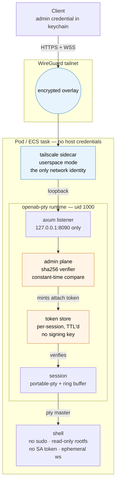

# openab-pty

Remote sandboxed terminal sessions: a small runtime that hands out a shell inside
a locked-down container, reached over a WireGuard tailnet.

**MIT licensed, images published to GHCR.** See [`LICENSE`](LICENSE) — and
[`NOTICE`](NOTICE) before pulling an image, because the images aggregate a
third-party agent CLI whose terms are its vendor's, not MIT.

## What it is for

A terminal that lives beside your ACP agents' workspace, in a pod rather than on
your host. The differentiator is the deployment and credential model, not terminal
features: the shell opens as `uid 1000` with no `sudo`, no service-account token,
no host credentials, a read-only root filesystem, and an ephemeral workspace, and
it is reached over a tailnet with per-session tokens that carry no signing key.

## Architecture

Two containers in one pod. The runtime never listens on a routable address — the
tailnet sidecar is the only thing with a network identity, and the two talk over
loopback inside the pod's network namespace.



### The two planes

| | Admin plane | Attach plane |
|---|---|---|
| Endpoints | `GET`/`POST /admin/sessions`, `…/{name}/renew`, `…/{name}/restart`, `DELETE …/{name}` | `WS /pty/{session}` |
| Credential | long-lived admin credential, checked against a `sha256:` hash | short-lived per-session token, minted by the admin plane |
| Held by | the operator's client | whatever attaches, once |

A session shell *can* reach the listener over loopback, so the split is what keeps
a compromised shell from managing its siblings: the shell never holds the admin
credential, and an attach token authorises exactly one session and expires.

## Two invariants that must not be quietly relaxed

1. **The admin plane's boundary is the credential.** A managed session can reach
   the listener over loopback — the claim is that it cannot authenticate to, or
   successfully invoke, admin operations, which is why the adversary test asserts
   a `401` rather than a refused connection. There is no in-container admin socket,
   so no code path treats being inside the container as authorization.
2. **Teardown is best-effort.** Tier 1 is the only kill domain implemented, and a
   process that leaves its process group may outlive its session until the pod or
   task is replaced. Label it as such wherever it is surfaced.

## Layout

| Path | What |
|---|---|
| `runtime/` | The Rust runtime. Static musl binary, no dependency on the OAB monorepo. |
| [`runtime/CLIENT-CONTRACT.md`](runtime/CLIENT-CONTRACT.md) | Implementation spec for any client, captured from the running service rather than transcribed from source. Start here to write one. |
| `deploy/` | Kubernetes pod and ECS Fargate task definitions, both verified. |
| [`docs/k8s-howto.md`](docs/k8s-howto.md) | Deploying on Kubernetes, including the failures worth knowing about in advance. |
| [`docs/ecsctl-howto.md`](docs/ecsctl-howto.md) | Deploying on ECS Fargate with `ecsctl`, same. Operator notes. |

There is no client in this repository. The contract above is the interface;
[`OpenAB Connect`](https://openab.dev) is one implementation of it and is not open
source. Anything that can hold a credential and speak WebSocket can be another —
§8 of the contract is a minimum viable client.

## Images

Published to `ghcr.io/openabdev/openab-pty`, one tag per agent CLI variant:

| Channel | Tag | Built from |
|---|---|---|
| push to `main` | `pre-beta-<variant>` | `openab:pre-beta-<variant>` |
| `v*` tag | `beta-<variant>` | `openab:beta-<variant>` |

Every build also publishes an immutable `<variant>-<sha>`. Deploy that if you ever
need to answer "which code is running" after the fact.

The `native` variant carries no agent CLI, and is the only one whose contents are
covered entirely by MIT-licensed code — see [`NOTICE`](NOTICE).

## Building

The runtime links against musl for a static binary:

```bash
cd runtime && cargo build --release --target x86_64-unknown-linux-musl
```

## Status

Phase 1, dogfooded on a k3s cluster and on ECS Fargate. The largest known gap is
**local echo prediction** in clients — the runtime measures 1.0 ms of echo latency
from its own host against 78–82 ms from a laptop over WiFi, so perceived quality is
set almost entirely client-side. A client that does not predict will feel sluggish
no matter what the runtime does.

## Contributing

See [`CONTRIBUTING.md`](CONTRIBUTING.md). Security issues go to
[`SECURITY.md`](SECURITY.md), not the public tracker.

The design of record is
[`docs/adr/openab-pty-runtime.md`](https://github.com/openabdev/openab/blob/main/docs/adr/openab-pty-runtime.md)
in `openabdev/openab`, and it stays there: it is a decision record for the OAB
project, not for this repository.
