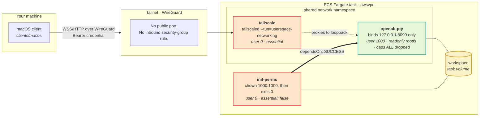
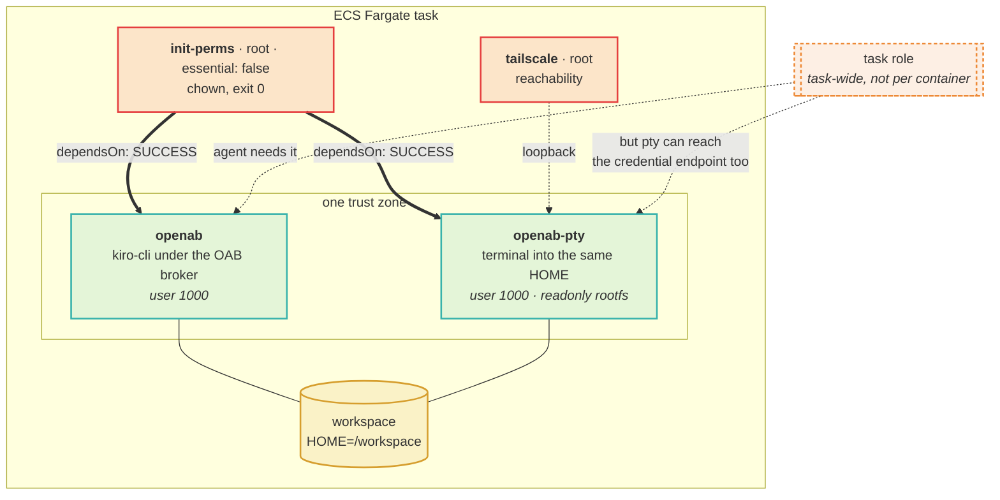

# Deploying openab-pty on ECS Fargate with ecsctl

Operator notes for this repository. **Not user-facing documentation** — Gate B on
[openabdev/openab#1479](https://github.com/openabdev/openab/issues/1479) governs
publishing docs, and it stays closed. This is the internal runbook for people who
already have the credentials.

Everything below was executed against real Fargate, not written from the API
reference. Where a step exists only because something failed, the failure is
stated.

---

## What you get

A shell inside a locked-down container, reached over a WireGuard tailnet, with
`kiro-cli` already on `PATH` because the image is built from the OAB agent image.
No public port, no SSH key, no host access.



Red outline is root, teal is the hardened session container, and the arrow from
`init-perms` is the ordering that makes the shared volume writable before the
non-root container starts. `openab-pty` never listens off-loopback: it refuses
to, while it holds no TLS key, so `tailscaled` sharing the namespace is the only
path in.

Two shapes, both in [`deploy/ecs/`](../deploy/ecs/):

| Manifest | Containers | Use for |
|---|---|---|
| [`pty-kiro.yaml`](../deploy/ecs/pty-kiro.yaml) | 3 | openab-pty on its own — the diagram above |
| [`kiro-with-pty.yaml`](../deploy/ecs/kiro-with-pty.yaml) | 4 | An agent **and** a terminal into the same `/workspace` — the adjacency case this runtime exists for |

The four-container shape adds the agent to the same volume, which is the point
and also the thing to understand before deploying it:



Two consequences worth reading twice. `/workspace` is **shared**, so a terminal
session can read and write anything the agent can, and the reverse — one trust
zone, by design. And an ECS task role is **task-wide**: the pty container is given
no role of its own, but it can still reach the task credential endpoint. If
either matters for your deployment, run the terminal in a separate task and share
the workspace over EFS.

Both need `ecsctl` **0.13.0 or later**. Earlier versions cannot express
`dependsOn`, per-container `user`, `readonlyRootFilesystem`,
`capabilitiesDrop`, or `mountPoints`, which means they cannot express this
deployment at all.

```bash
curl -sL https://github.com/oablab/ecsctl/releases/latest/download/ecsctl-darwin-arm64.tar.gz \
  | tar xz -O > ~/.local/bin/ecsctl && chmod +x ~/.local/bin/ecsctl
ecsctl --version   # must be >= 0.13.0
```

---

## Prerequisites

### 1. The image, in a registry the task can pull from

```bash
# Built by CI on every push to main; see .github/workflows/image.yml
123456789012.dkr.ecr.us-east-1.amazonaws.com/openab-pty:pre-beta-kiro
```

The tag suffix names the base variant, because the base decides which agent CLI
is adjacent. `pre-beta-kiro` carries `kiro-cli`.

### 2. A credential, stored as its hash

The runtime never sees the credential — only a verifier. Generate the pair:

```bash
CRED=$(openssl rand -hex 32)
HASH="sha256:$(printf '%s' "$CRED" | sha256sum | cut -d' ' -f1)"
echo "$CRED"   # give this to the client; it is never stored server-side
echo "$HASH"   # this goes in the secret
```

`admin_credential_hash` is the one config key the validator refuses `${VAR}` on.
A fail-open there would let a poisoned projection disable admin auth, so the
entrypoint materialises a projection containing the literal hash, and the hash
arrives through the environment. That is why the manifests pass
`PTY_ADMIN_HASH` as a `secrets:` entry rather than interpolating it.

### 3. A tailscale auth key, and a secret holding both

```bash
aws secretsmanager create-secret --name openab-pty/fargate --region us-east-1 \
  --secret-string "{\"PTY_ADMIN_HASH\":\"$HASH\",\"TS_AUTHKEY\":\"tskey-auth-...\"}"
```

### 4. A log group, created in advance

```bash
aws logs create-log-group --log-group-name /ecs/pty-kiro --region us-east-1
aws logs put-retention-policy --log-group-name /ecs/pty-kiro \
  --retention-in-days 7 --region us-east-1
```

**Why in advance:** `awslogs-create-group` requires `logs:CreateLogGroup`, which
`AmazonECSTaskExecutionRolePolicy` does not grant. Relying on auto-creation makes
the task fail with a `ResourceInitializationError` that does not mention
permissions.

### 5. An execution role, and deliberately no task role for the pty container

The execution role needs `AmazonECSTaskExecutionRolePolicy` (covers ECR pull and
logs) plus `secretsmanager:GetSecretValue` on the secret above.

**Do not give openab-pty a task role.** It holds no AWS credentials by design —
a terminal session inheriting the task role would hand every session the
deployment's cloud permissions. In `kiro-with-pty.yaml` the task role exists for
the *agent*, and this is a real consequence of ECS's model to understand: a task
role is task-wide, so the pty container in that manifest can reach the ECS
credential endpoint too. If that matters for your deployment, run the terminal in
its own task and share the workspace over EFS instead.

---

## Deploy

```bash
# Edit the manifest: subnets, securityGroups, role ARNs, secret ARNs, hostname
$EDITOR deploy/ecs/pty-kiro.yaml

ecsctl apply -f deploy/ecs/pty-kiro.yaml --wait
```

Expect roughly a minute. `--wait` polls until `running == desired`.

```
📋 Registering task definition...
  ✓ arn:aws:ecs:...:task-definition/pty-kiro:1
➕ Creating service pty-kiro...
  ✓ Service created
⏳ Waiting for deployment to stabilize...
  ✅ 1/1 tasks running
✓ Deployment stable
```

---

## Verify it actually works

Four checks, in the order that isolates failures fastest.

### 1. Did every container do its job?

```bash
TASK=$(aws ecs list-tasks --cluster openab --family pty-kiro \
  --desired-status RUNNING --query 'taskArns[0]' --output text --region us-east-1)
aws ecs describe-tasks --cluster openab --tasks "$TASK" --region us-east-1 \
  --query 'tasks[0].containers[].{name:name,status:lastStatus,exit:exitCode}'
```

What correct looks like — note that a **stopped** init container is the success
case, not a failure:

```
init-perms   STOPPED   exit 0     ← chowned the volumes, then exited
tailscale    RUNNING
openab-pty   RUNNING              ← started only after init-perms exited zero
```

If `openab-pty` is `RUNNING` while `init-perms` is still `PENDING`, `dependsOn`
did not take effect and the volumes are probably still root-owned.

### 2. Is it on the tailnet?

```bash
tailscale status | grep pty-kiro
```

### 3. Does the admin plane answer, and refuse?

```bash
IP=100.x.y.z   # from tailscale status

# Unauthenticated must be 401 -- the credential is the whole boundary
curl -s -o /dev/null -w "%{http_code}\n" http://$IP:8090/admin/sessions

# Authenticated returns state
curl -s http://$IP:8090/admin/sessions -H "Authorization: Bearer $CRED"
```

A `401` here is a passing result. The admin plane shares the attach listener, so
a managed session *can* reach it — the claim is that it cannot authenticate, not
that it is unreachable.

### 4. Does a session open?

```bash
curl -s -X POST http://$IP:8090/admin/sessions \
  -H "Authorization: Bearer $CRED" -H "Content-Type: application/json" \
  -d '{"name":"work"}'
# → {"session":"work","generation":1,"token":"...","token_expires_in_secs":43199}
```

Then attach with the macOS client in [`clients/macos/`](../clients/macos/), or
any client written to [`runtime/CLIENT-CONTRACT.md`](../runtime/CLIENT-CONTRACT.md).

---

## Things that will bite you

Each of these cost real debugging time.

### `ecsctl exec` does not work on the pty container, and that is correct

```
An error occurred (InvalidParameterException) ... the execute command agent isn't running
```

`readonlyRootFilesystem: true` is **incompatible with ECS Exec by AWS design**:
the SSM agent needs a writable container filesystem. AWS states this explicitly
in [amazon-ecs-exec-checker#21](https://github.com/aws-containers/amazon-ecs-exec-checker/issues/21).

This is not a bug to fix. The terminal you actually want is the PTY session, not
ECS Exec. If you need `exec` for debugging, temporarily drop
`readonlyRootFilesystem` — and understand you have removed a sandbox property
while you do.

`ecsctl exec` on the *other* containers works normally.

### `execEnabled: true` requires a task role

```
InvalidParameterException: ... a valid taskRoleArn is not being used
```

ECS Exec needs SSM permissions on the task role. `pty-kiro.yaml` omits
`execEnabled` for this reason — see the point above about why you do not want it
on the pty container anyway.

### `subnets` is not optional

```
InvalidParameterException: subnets can not be empty
```

`awsvpc` mode requires them and `ecsctl` does not infer a default. Copy from a
service already running in the cluster:

```bash
aws ecs describe-services --cluster openab --services openab-b0 --region us-east-1 \
  --query 'services[0].networkConfiguration.awsvpcConfiguration'
```

### ARNs in YAML need quotes

```
yaml.scanner.ScannerError: mapping values are not allowed here
```

`arn:aws:secretsmanager:us-east-1:...` contains colons, so YAML reads it as a
nested mapping. Every ARN in the manifests is quoted. This does not happen in the
raw JSON task definitions, only after translating to YAML.

### Spec-level fields alongside `containers[]` are refused

```
Error: spec.containers is set, so the spec-level container fields (logGroup)
are not used -- move them into the relevant entry under spec.containers
```

Deliberate, added in ecsctl 0.13.0. Previously they were silently ignored, which
is how a migration from single-container mode loses every environment variable.
Put `logGroup`, `env`, `secrets`, `command` and `port` inside the container that
needs them.

### The init container must be `essential: false`

AWS refuses a `SUCCESS`/`COMPLETE` dependency on an essential container:

> A dependency container with SUCCESS or COMPLETE condition cannot be an
> essential container

The restriction binds the container being *waited on*, not the one declaring
`dependsOn`. An essential app container waiting for a non-essential init
container is legal and is exactly this shape. ecsctl 0.13.0 checks this locally.

### Fargate bind mounts are root-owned with no `fsGroup`

Kubernetes has `fsGroup`; Fargate has nothing equivalent. A `uid 1000` container
cannot write to a task volume until something chowns it, which is the entire
reason `init-perms` exists.

### tailscale's containerboot fails on Fargate

It exits in under a second with `timed out waiting for tailscaled socket`. The
manifests bypass it and run `tailscaled --tun=userspace-networking` plus
`tailscale up` directly. Do not "simplify" this back to containerboot.

### An attached session can look dead

`scrollback_replay = false` means attaching does not replay output produced
before you attached. A session nobody has typed in shows a blank terminal even
though the WebSocket is connected and the server logged the attach. Press Enter
to get a prompt. Check `bytes_written` in `/admin/sessions` to tell a connected
session from a broken one.

---

## Operating it

### Change configuration

Edit the manifest and re-apply. `ecsctl` registers a new task definition revision
and updates the service.

```bash
ecsctl apply -f deploy/ecs/pty-kiro.yaml --wait
```

Sessions do not survive this — the task is replaced. The runtime notifies
attached clients and drains for 3 seconds first.

### Read logs

```bash
ecsctl log pty-kiro -n 50
```

This follows the **application** container. ecsctl 0.13.0 fixed a bug where it
resolved to the tailscale sidecar instead, silently showing `tailscaled` output.

### Export what is running

```bash
ecsctl export pty-kiro -f current.yaml
```

Round-trips: the output is a spec `apply` accepts, with `user`,
`readonlyRootFilesystem`, `capabilitiesDrop`, `dependsOn` and `mountPoints`
`readOnly` all preserved. Where a task definition cannot be represented
losslessly, export refuses rather than degrading silently.

### `ecsctl update` will refuse this service

```
service has 3 containers (...); update only supports single-container services
```

Correct: `update` rebuilds the task definition from the flat single-container
fields and would drop the sidecars. Use `export` → edit → `apply`, which is what
the error message now says.

### Tear down

```bash
ecsctl delete pty-kiro
aws logs delete-log-group --log-group-name /ecs/pty-kiro --region us-east-1
```

The tailnet node lingers as an offline device unless the auth key was ephemeral;
remove it from the Tailscale admin console.

---

## Cost

1 vCPU / 2 GB on Fargate is roughly **$0.05/hour** in us-east-1, so about $36 a
month if left running. `kiro-with-pty.yaml` is 2 vCPU / 4 GB, so double that.

This runtime is for sessions you actually attach to. Scale to zero when you are
not using it:

```bash
ecsctl apply -f deploy/ecs/pty-kiro.yaml --set spec.desiredCount=0 --wait
```

Sessions do not survive that either — the PTY and everything in it is gone.
Ephemerality is a property of this runtime, not an accident.

---

## Measured behaviour

Numbers from real runs, so expectations are calibrated:

| | Result |
|---|---|
| Echo round-trip from a host on the same network | **1.0 ms** |
| From a laptop over WiFi via the tailnet | **78–82 ms**, bimodal, 0% loss — dominated by WiFi power saving, not the runtime |
| 20 sessions created, 0 attached | runtime **4.2 MB** RSS |
| 20 sessions created, 20 attached | runtime **7.8–9.4 MB** RSS across repeated samples |
| macOS client, 0 panes → 20 panes attached | **52 MB → 71 MB** physical footprint (~1 MB per pane) |
| Sessions left detached 90 minutes | both alive, `leaked_processes: 0` |
| 9-hour soak | 0 restarts, TTLs expired on schedule, 0 leaks |

The memory figures are a range because they are: repeated samples of the same
20-attached state gave 7.8 and 9.4 MB, and the client measured 101 MB at 10 panes
before settling at 71 MB with 20 — macOS had reclaimed transient allocations in
between. A single sample here is not a measurement. What the range does establish
is the order of magnitude: **tens of MB, not hundreds**, because the terminal view
renders through CoreGraphics rather than the GPU path (SwiftTerm ships a Metal
renderer but it is off by default and this client never enables it). Analyses of
GPU-accelerated terminals holding ~1 GB of surfaces across 20 tabs do not
transfer here.

Perceived terminal quality is set almost entirely by the client and the network
link — the server contributes about 1 ms of the 80. Do not chase server-side
latency work on the strength of a laptop measurement.
